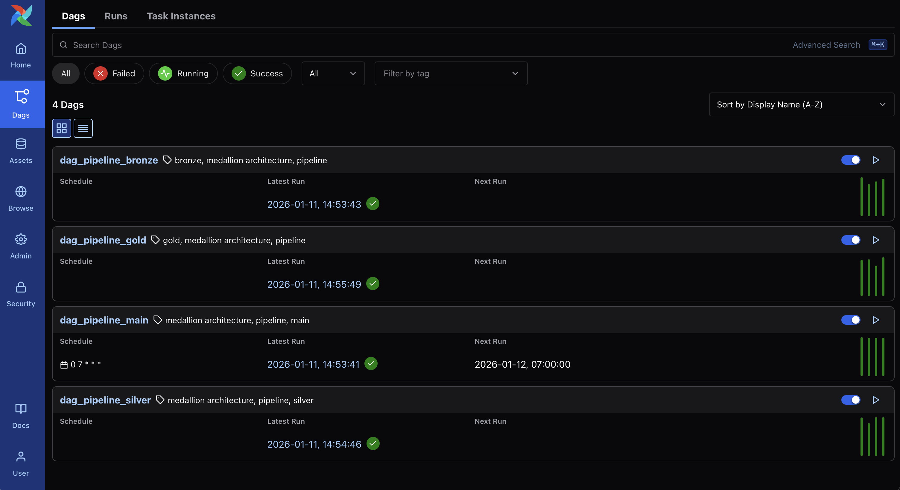
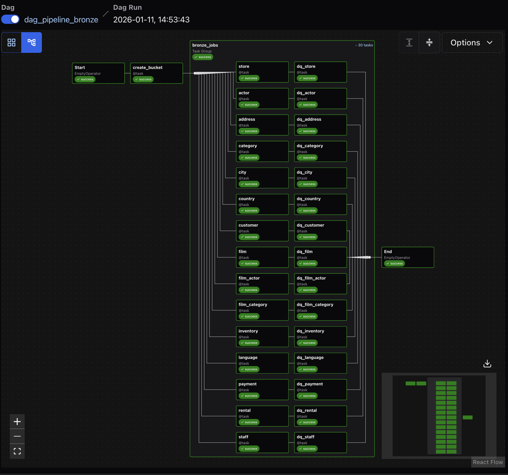
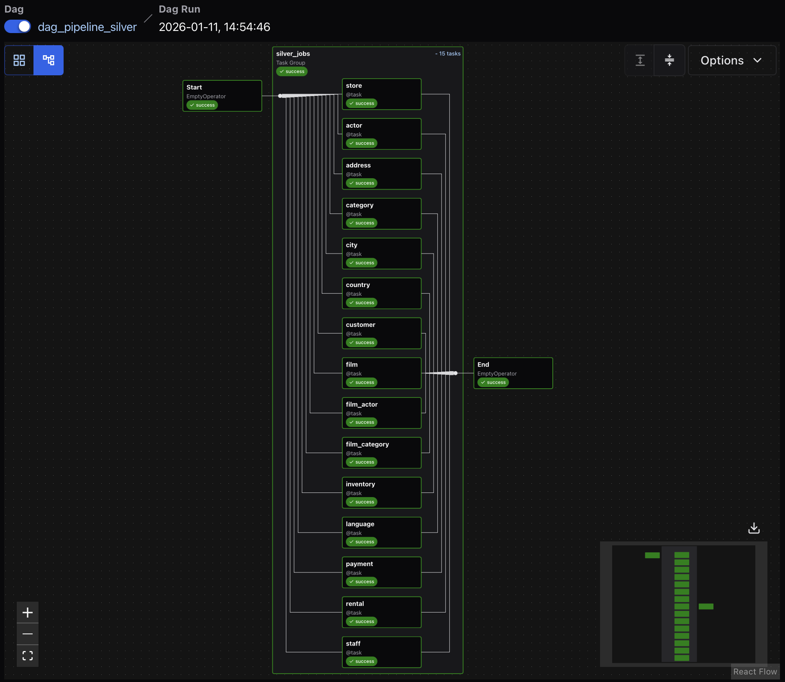
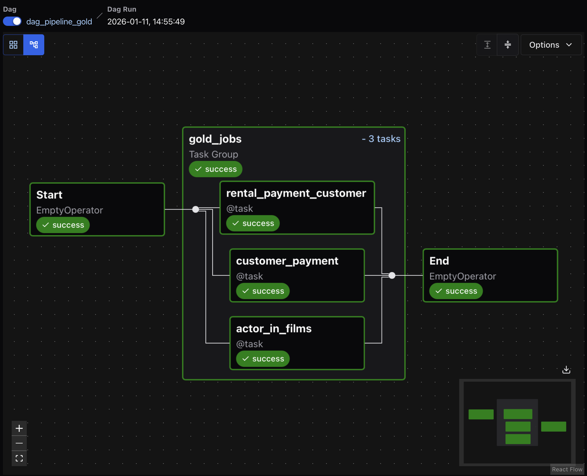
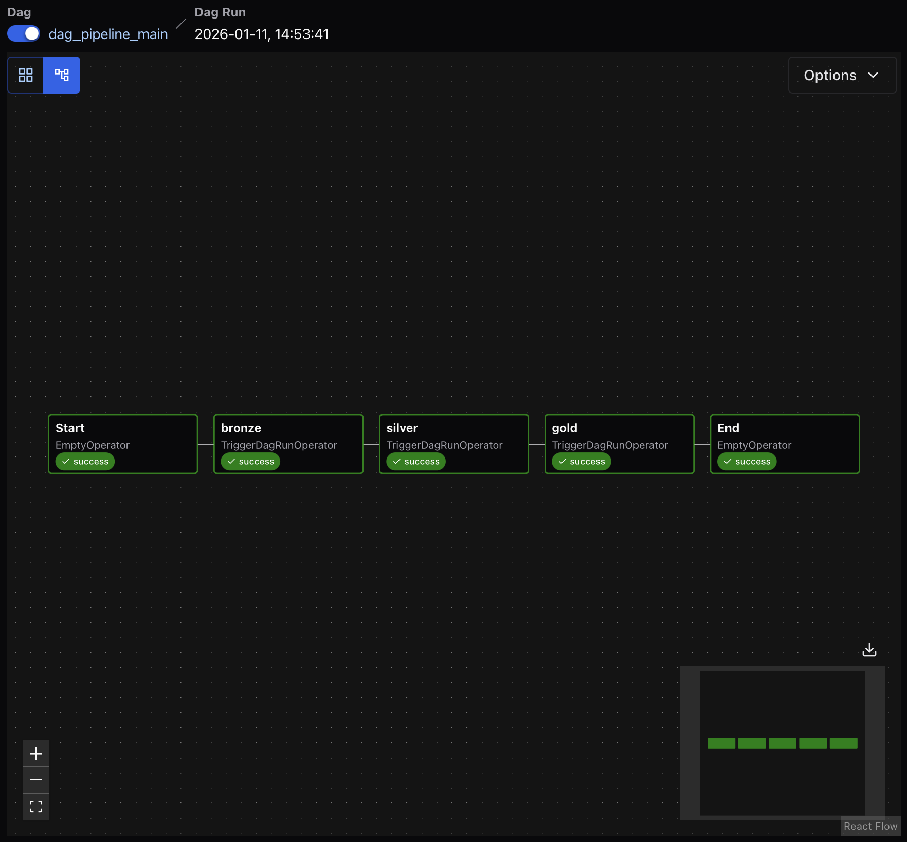

# DVD Rental Data Pipeline - Medallion Architecture

A production-ready data pipeline built with Apache Airflow implementing the Medallion Architecture (Bronze, Silver, Gold layers) for the DVD Rental database. The pipeline extracts data from PostgreSQL, transforms it using DuckDB, and stores it in AWS S3 as Parquet files with partitioning support.

## 📋 Table of Contents

- [Overview](#overview)
- [Architecture](#architecture)
- [Pipeline Stages](#pipeline-stages)
- [Prerequisites](#prerequisites)
- [Installation](#installation)
- [Configuration](#configuration)
- [Usage](#usage)
- [Data Quality](#data-quality)
- [Technologies](#technologies)
- [Project Structure](#project-structure)

## 🎯 Overview

This project implements a complete ETL (Extract, Transform, Load) pipeline that:

- **Extracts** data from a PostgreSQL DVD Rental database
- **Transforms** data through three medallion layers (Bronze → Silver → Gold)
- **Loads** processed data to AWS S3 in optimized Parquet format
- **Orchestrates** the entire workflow using Apache Airflow
- **Validates** data quality at each stage
- **Partitions** data by execution timestamp for incremental processing

The pipeline follows data engineering best practices including:
- Idempotent operations
- Data partitioning
- Parallel processing
- Data quality checks
- Error handling and logging

## 🏗️ Architecture

The pipeline implements the **Medallion Architecture** with three distinct layers:

```
PostgreSQL Database
        ↓
    [Bronze Layer] - Raw data ingestion
        ↓
    [Silver Layer] - Data cleaning and deduplication
        ↓
    [Gold Layer] - Business-level aggregations
        ↓
    AWS S3 (Parquet files)
```

### All DAGs Overview



The project consists of **4 Apache Airflow DAGs** that work together to implement the complete data pipeline:

1. **dag_pipeline_bronze** - Extracts raw data from PostgreSQL to S3
2. **dag_pipeline_silver** - Cleans and deduplicates Bronze data
3. **dag_pipeline_gold** - Creates business-level analytical tables
4. **dag_pipeline_main** - Orchestrates the entire pipeline execution

All DAGs are tagged with "medallion architecture" and "pipeline" for easy filtering and organization in the Airflow UI.

## 📊 Pipeline Stages

### 1. Bronze Layer - Raw Data Ingestion



The Bronze layer extracts raw data from the PostgreSQL database and loads it into S3 without transformations.

**Process:**
1. **Create S3 Bucket**: Ensures the target S3 bucket exists
2. **Parallel Table Extraction**: Dynamically discovers all tables from the database and processes them in parallel
3. **Data Quality Checks**: Validates each table after extraction

**Tables Processed:**
- `actor`, `address`, `category`, `city`, `country`, `customer`
- `film`, `film_actor`, `film_category`, `inventory`, `language`
- `payment`, `rental`, `staff`, `store`

**Output Format:**
```
s3://{bucket}/bronze/{table_name}/{partition_date}/{table_name}.parquet
```

**Code Highlights:**
- Automatic table discovery using SQLAlchemy inspection
- TaskGroup for parallel processing of multiple tables
- Partition-based organization by execution timestamp
- Individual data quality checks per table

### 2. Silver Layer - Data Cleaning and Standardization



The Silver layer reads from Bronze, applies transformations, and removes duplicates to create clean, deduplicated datasets.

**Process:**
1. **Read Bronze Data**: Loads Parquet files from Bronze layer
2. **Remove Duplicates**: Uses DuckDB `SELECT DISTINCT` to eliminate duplicate records
3. **Write to Silver**: Stores cleaned data in Silver layer with partitioning

**Tables Processed:**
- All tables from Bronze layer are processed
- Dynamic task generation based on available Bronze tables

**Transformations:**
- Deduplication using `DISTINCT`
- Maintains data types and schema
- Preserves partitioning strategy

**Output Format:**
```
s3://{bucket}/silver/{table_name}/{partition_date}/{table_name}.parquet
```

**Technology:**
- Uses DuckDB for fast in-memory data processing
- Leverages DuckDB's S3 integration for direct read/write
- Handles AWS credentials (IAM roles for MWAA, local credentials for development)

### 3. Gold Layer - Business Aggregations



The Gold layer creates business-ready analytical tables by joining and aggregating data from the Silver layer.

**Process:**
1. **Read Silver Data**: Loads multiple tables from Silver layer
2. **Apply Business Logic**: Performs joins and aggregations
3. **Create Analytical Tables**: Generates denormalized tables optimized for analytics

**Gold Tables:**

#### 1. **actor_in_films**
Combines actor information with their film appearances.

**Query:**
```sql
SELECT 
    f.film_id, 
    f.title, 
    a.first_name, 
    a.last_name
FROM film f
LEFT JOIN film_actor fa ON f.film_id = fa.film_id
LEFT JOIN actor a ON fa.actor_id = a.actor_id
```

#### 2. **customer_payment**
Aggregates payment information by customer.

**Query:**
```sql
SELECT 
    customer_id,
    SUM(amount) as total_amount,
    COUNT(*) as number_of_payments,
    MIN(payment_date) as first_payment,
    MAX(payment_date) as last_payment
FROM payment
GROUP BY customer_id
```

#### 3. **rental_payment_customer**
Creates a comprehensive view combining rental, payment, and customer data.

**Query:**
```sql
SELECT 
    r.rental_id,
    r.rental_date,
    r.return_date,
    r.customer_id,
    c.first_name,
    c.last_name,
    c.email,
    p.payment_id,
    p.amount,
    p.payment_date
FROM rental r
LEFT JOIN payment p ON r.rental_id = p.rental_id
LEFT JOIN customer c ON r.customer_id = c.customer_id
```

**Output Format:**
```
s3://{bucket}/gold/{table_name}/{partition_date}/{table_name}.parquet
```

### 4. Main Pipeline - Orchestration Layer



The Main pipeline (`dag_pipeline_main`) is the orchestrator that manages the execution of all three medallion layers in the correct sequence.

**Process:**
1. **Start**: Initialize the pipeline
2. **Trigger Bronze**: Execute the Bronze layer DAG and wait for completion
3. **Trigger Silver**: Execute the Silver layer DAG and wait for completion
4. **Trigger Gold**: Execute the Gold layer DAG and wait for completion
5. **End**: Finalize the pipeline execution

**Key Features:**
- **Scheduled Execution**: Runs daily at 07:00 AM (Europe/Amsterdam timezone)
- **Sequential Processing**: Ensures each layer completes successfully before moving to the next
- **Deferrable Operators**: Uses `TriggerDagRunOperator` with `deferrable=True` for efficient resource utilization
- **Error Handling**: Only proceeds if previous stages succeed (allowed_states=['success'])
- **Synchronous Execution**: Waits for completion of each sub-DAG (`wait_for_completion=True`)
- **Reset Capability**: Can reset and re-run failed DAG runs (`reset_dag_run=True`)

**DAG Configuration:**
```python
@dag(
    dag_id='dag_pipeline_main',
    schedule='0 7 * * *',  # Daily at 7 AM
    start_date=pendulum.datetime(2025, 11, 30, tz='Europe/Amsterdam'),
    catchup=False,
    tags=['pipeline', 'medallion architecture', 'main']
)
```

**Workflow:**
```
Start → Bronze → Silver → Gold → End
```

This orchestration pattern ensures:
- **Data Consistency**: Each layer builds upon validated data from the previous layer
- **Failure Isolation**: If any layer fails, the pipeline stops and doesn't corrupt downstream data
- **Observability**: Clear execution flow visible in Airflow UI
- **Maintainability**: Each layer can be developed and tested independently

## 🔧 Prerequisites

- Docker and Docker Compose
- AWS Account with S3 access
- PostgreSQL database (DVD Rental sample database)
- At least 4GB of RAM for Docker

## 🚀 Installation

1. **Clone the repository:**
```bash
git clone <repository-url>
cd pipeline_dvdrental
```

2. **Create environment file:**
```bash
cp .env.example .env
```

3. **Configure environment variables in `.env`:**
```env
# Airflow
AIRFLOW_UID=50000

# PostgreSQL Database
POSTGRES_USER=your_db_user
POSTGRES_PASSWORD=your_db_password
POSTGRES_DB=dvdrental
POSTGRES_HOST=your_db_host
POSTGRES_PORT=5432

# AWS Configuration
AWS_ACCESS_KEY_ID=your_access_key
AWS_SECRET_ACCESS_KEY=your_secret_key
BUCKET_NAME=your-s3-bucket-name
REGION_NAME=us-east-1
```

4. **Build and start the services:**
```bash
docker-compose up -d
```

5. **Initialize Airflow (first time only):**
```bash
docker-compose exec airflow-webserver airflow db init
docker-compose exec airflow-webserver airflow users create \
    --username admin \
    --firstname Admin \
    --lastname User \
    --role Admin \
    --email admin@example.com \
    --password admin
```

6. **Access Airflow UI:**
Open your browser and navigate to: `http://localhost:8080`
- Username: `admin`
- Password: `admin` (or the password you set)

## ⚙️ Configuration

### Airflow Variables

Set these variables in the Airflow UI (Admin → Variables):

- `BUCKET_NAME`: AWS S3 bucket name
- `REGION_NAME`: AWS region (e.g., us-east-1)

Alternatively, the pipeline will fall back to environment variables from `.env` file.

### Database Connection

The pipeline expects a PostgreSQL connection configured in Airflow:

**Connection ID:** `postgres_default`

Configure it via Airflow UI (Admin → Connections):
- Connection Type: Postgres
- Host: your database host
- Schema: dvdrental
- Login: your username
- Password: your password
- Port: 5432

## 🎮 Usage

### Running the Complete Pipeline

1. **Navigate to the Airflow UI**
2. **Locate the `dag_pipeline_main` DAG**
3. **Enable the DAG** by toggling the switch
4. **Trigger manually** or wait for the scheduled run (daily at 07:00 AM)

The main pipeline will automatically:
1. Execute the Bronze layer (extract all tables)
2. Execute the Silver layer (clean and deduplicate)
3. Execute the Gold layer (create analytical tables)

### Running Individual Layers

You can also run individual DAGs:

- **Bronze Layer Only:** Trigger `dag_pipeline_bronze`
- **Silver Layer Only:** Trigger `dag_pipeline_silver`
- **Gold Layer Only:** Trigger `dag_pipeline_gold`

### Monitoring

- **Task Status:** Check the Grid or Graph view in Airflow UI
- **Logs:** Click on any task to view detailed execution logs
- **S3 Verification:** Check your S3 bucket for generated Parquet files

## ✅ Data Quality

The pipeline includes data quality checks in the Bronze layer:

**File:** `dags/src/data_quality_checks.py`

**Checks performed:**
- Row count validation
- Schema validation
- Null value checks
- Data type verification

Each Bronze table goes through a data quality check (`dq_{table_name}`) before the pipeline proceeds.

## 🛠️ Technologies

| Technology | Purpose |
|------------|---------|
| **Apache Airflow 3.0.6** | Workflow orchestration |
| **Docker & Docker Compose** | Containerization and deployment |
| **PostgreSQL 16** | Source database |
| **AWS S3** | Data lake storage |
| **Boto3** | AWS SDK for Python |
| **Pandas** | Data manipulation (Bronze layer) |
| **DuckDB** | Fast analytical queries (Silver & Gold layers) |
| **PyArrow** | Parquet file handling |
| **SQLAlchemy** | Database abstraction |
| **Python 3.12** | Programming language |

## 📁 Project Structure

```
pipeline_dvdrental/
├── docker-compose.yaml          # Docker services configuration
├── dockerfile                   # Custom Airflow image
├── requirements.txt             # Python dependencies
├── .env                         # Environment variables (not in repo)
├── config/
│   └── airflow.cfg             # Airflow configuration
├── dags/
│   ├── dag_pipeline_main.py    # Main orchestration DAG
│   ├── dag_pipeline_bronze.py  # Bronze layer DAG
│   ├── dag_pipeline_silver.py  # Silver layer DAG
│   ├── dag_pipeline_gold.py    # Gold layer DAG
│   └── src/
│       ├── __init__.py
│       ├── aws_secrets.py      # AWS Secrets Manager integration
│       ├── bronze.py           # Bronze layer logic
│       ├── silver.py           # Silver layer logic
│       ├── gold.py             # Gold layer logic
│       ├── db_connections.py   # Database connection utilities
│       ├── data_quality_checks.py  # Data quality validation
│       └── vars_airflow.py     # Airflow variables helper
├── logs/                        # Airflow execution logs
└── plugins/                     # Airflow plugins
```

## 🔍 Key Features

### Dynamic Task Generation
The pipeline automatically discovers all tables in the source database and creates tasks dynamically, eliminating the need for manual configuration when tables are added or removed.

### Partition-Based Processing
All data is partitioned by execution timestamp (`YYYY-MM-DD_HH-mm-ss`), enabling:
- Incremental processing
- Historical data preservation
- Easy rollback to previous versions
- Time-travel queries

### Parallel Processing
- Bronze layer processes all tables in parallel using TaskGroups
- Maximizes throughput and minimizes execution time

### Environment Flexibility
- Works locally with Docker Compose
- Compatible with AWS MWAA (Managed Workflows for Apache Airflow)
- Automatic credential detection (IAM roles vs. local credentials)

### Error Handling
- Comprehensive logging at each stage
- Graceful error handling with detailed error messages
- Task retry capabilities configured in Airflow

## 📈 Performance Considerations

- **Parquet Format:** Columnar storage format optimized for analytics
- **DuckDB:** Fast in-memory analytical processing
- **Parallel Execution:** Multiple tables processed simultaneously
- **Partition Pruning:** Only relevant partitions are read during queries

## 🔒 Security

- Environment variables for sensitive credentials
- Support for AWS IAM roles (no hardcoded credentials)
- AWS Secrets Manager integration available
- Airflow connections encrypted in database

## 🐛 Troubleshooting

### Issue: Pipeline fails at Bronze layer
- Check PostgreSQL connection in Airflow
- Verify database credentials in `.env`
- Check database network accessibility

### Issue: S3 upload fails
- Verify AWS credentials
- Check S3 bucket permissions
- Ensure bucket exists or pipeline has create permissions

### Issue: DuckDB memory errors
- Increase Docker container memory allocation
- Process smaller batches of data
- Optimize DuckDB queries

## 📝 License

This project is for educational and demonstration purposes.

## 👥 Contributing

Contributions are welcome! Please feel free to submit a Pull Request.

## 📧 Contact

For questions or support, please open an issue in the repository.

---

**Built with ❤️ using Apache Airflow and the Medallion Architecture pattern**
